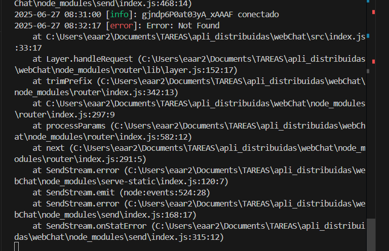

<div align="center">

# 💬 Chat en Tiempo Real con Sockets

[](https://nodejs.org/)
[](https://socket.io/)
[](https://getbootstrap.com/)

**Desarrollado por:** Edison Arambulo Rojas  
**Fecha:** 30 de Mayo de 2025

[🚀 Demo en vivo](http://localhost:3000) | [📖 Documentación](#documentación) | [⚙️ Instalación](#instalación)

</div>

## 📋 Descripción

> Un chat moderno en tiempo real que permite la comunicación instantánea entre múltiples usuarios

Este proyecto implementa un sistema de chat utilizando WebSockets, ofreciendo una experiencia de comunicación fluida y eficiente. Las características principales incluyen:

✨ **Características clave:**
- 🔄 Comunicación bidireccional en tiempo real
- 📱 Diseño responsive para todos los dispositivos
- 🎨 Interfaz moderna y minimalista
- 🚀 Bajo consumo de recursos del servidor
- 💫 Experiencia de usuario mejorada sin recargas
- ⚡ Entrega instantánea de mensajes

## 🌟 Repositorio Base

> Este proyecto es una mejora del [repositorio original](https://github.com/paulosk8/webChat/tree/main) proporcionado por el docente

**Ramas principales:**
- `main` - Código inicial del proyecto
- `implementacion-chat` - Versión final de referencia

## 🏗️ Estructura del Proyecto

```
webChat/
├── src/
│   ├── public/
│   │   ├── css/
│   │   │   └── style.css
│   │   └── js/
│   │       └── script.js
│   ├── views/
│   │   └── index.html
│   └── realTimeServer.js
├── screenshots/
└── README.md
```

## ✨ Características Principales

1. **Diseño Moderno**
   - Interfaz limpia y minimalista
   - Paleta de colores moderna
   - Diseño responsive para móviles y tablets
   

2. **Sistema de Login**
   - Modal de inicio con nombre de usuario
   - Validación de nombres duplicados
   - Persistencia de sesión
   

3. **Selector de Emojis**
   - Categorías organizadas
   - Emojis nativos del sistema
   - Interfaz intuitiva
   

4. **Notificaciones**
   - Alertas de usuarios conectados/desconectados
   

## 🚀 Instalación y Uso

1. **Clonar el Repositorio**
   ```bash
   git clone [URL del repositorio]
   cd webChat
   ```

2. **Instalar Dependencias**
   ```bash
   npm install
   ```

3. **Iniciar el Servidor**
   ```bash
   cd src
   node index.js
   ```

4. **Acceder al Chat**
   - Abrir `http://localhost:3000` en el navegador
   - Ingresar un nombre de usuario
   - ¡Comenzar a chatear!

## 📝 Aprendizajes y Conclusiones

- Implementación práctica de WebSockets
- Manejo de eventos en tiempo real
- Diseño de interfaces responsivas
- Gestión de estado en aplicaciones web

## 🔧 Desafíos y Soluciones

1. **Manejo de Usuarios Simultáneos**
   - Problema: Conflictos con nombres de usuario duplicados
   - Solución: Implementación de validación en tiempo real

2. **Selector de Emojis**
   - Problema: Compatibilidad entre navegadores
   - Solución: Uso de emojis nativos y diseño adaptativo

3. **Notificaciones**
   - Problema: Experiencia de usuario en múltiples pestañas
   - Solución: Sistema de notificaciones centralizado

## 🛠️ Informe de Manejo de Excepciones

> A continuación se presenta un informe detallado sobre el refuerzo del manejo de excepciones y validaciones implementado en el proyecto.

### 📄 Portada

| Elemento | Detalle |
|----------|---------|
| **Título** | Informe de Buenas Prácticas de Manejo de Excepciones en *WebChat* |
| **Estudiante** | Edison Arambulo Rojas |
| **Carrera / Curso** | Aplicaciones Distribuidas – Unidad 1 |
| **Fecha** | 27 de Junio de 2025 |

### ✨ Introducción
El manejo adecuado de excepciones es esencial en el desarrollo backend para garantizar estabilidad, seguridad y mantenibilidad. Un flujo de errores predecible evita fallos silenciosos, facilita el *debugging* e incrementa la confianza del usuario y del equipo de desarrollo.

### ⚙️ Tipos de Errores en Node.js

| Tipo | Descripción |
|------|-------------|
| **SyntaxError** | Errores de sintaxis detectados por el motor de JavaScript antes de ejecutar el código. |
| **TypeError / ReferenceError** | Errores en tiempo de ejecución: acceso a propiedades inexistentes, referencias indefinidas, etc. |
| **SystemError** | Errores producidos por el sistema operativo (archivos, red, permisos). |
| **CustomError** | Errores definidos por el desarrollador para contextos de dominio específicos. |

### 👍 Buenas Prácticas Aplicadas
1. **Bloques `try-catch`**: Se envolvieron eventos críticos de Socket.IO para capturar errores de validación.
2. **Manejo asíncrono**: Uso de `async/await` y captura de *Promise rejections* con `process.on('unhandledRejection')`.
3. **Middleware Global**: Se añadió un *middleware* Express que centraliza las respuestas de error JSON (400/404/500).
4. **Logging con Winston**: Se implementó un *logger* configurable (`src/utils/logger.js`) que registra errores y eventos en consola y archivo.
5. **Validación con Zod**:  Se crearon esquemas para validar nombre de usuario y mensajes, evitando datos malformados.
6. **Respuestas HTTP coherentes**: Mensajes JSON estructurados (`{ error: '...' }`) y códigos de estado apropiados.

### 🧩 Ejemplos Aplicados

#### Ejemplo 1 – API REST Lambda (Serverless) *(referencial)*
```js
// handler.js
exports.createUser = async (event) => {
  try {
    const body = JSON.parse(event.body);
    userSchema.parse(body); // zod validation
    const result = await db.put(body);
    return { statusCode: 201, body: JSON.stringify(result) };
  } catch (err) {
    logger.error(err);
    return { statusCode: err.status || 500, body: JSON.stringify({ error: err.message }) };
  }
};
```

#### Ejemplo 2 – Chat con Socket.IO (Proyecto actual)
```js
socket.on('chat message', (data) => {
  try {
    chatMessageSchema.parse(data);
    io.emit('chat message', data);
  } catch (err) {
    logger.error(err);
    socket.emit('error', 'Mensaje no válido');
  }
});
```


### 🔄 Reutilización del Código
- **`utils/logger.js`** puede importarse en cualquier módulo.
- Esquemas Zod centralizados facilitan la validación en nuevos *endpoints* o microservicios.
- El *middleware* de errores Express se mantiene único aunque se agreguen rutas.

### 🧩 Middleware Global de Errores (Express)
```js
app.use((err, req, res, _next) => {
  logger.error(err);
  res.status(err.status || 500).json({ error: err.message });
});
```

### 📝 Conclusiones
El refactor refuerza la robustez de *WebChat*. Se redujo la posibilidad de que fallos no controlados derriben el servidor y se mejoró la trazabilidad mediante *logging* estructurado. Las validaciones previas evitan estados inconsis­tentes y aportan claridad al usuario final.

**Dificultades**: compatibilidad de dependencias y duplicidad de código legado.

**Mejoras Futuras**:
- Integrar *eslint* + *husky* para prevenir errores de estilo en *pre-commit*.
- Tests automatizados con *Jest* de los manejadores de errores.

---

## 📚 Referencias y Recursos

1. [Socket.IO Documentation](https://socket.io/docs/v4/)
2. [Bootstrap 5 Documentation](https://getbootstrap.com/docs/5.3/)
3. [MDN Web Docs - WebSockets API](https://developer.mozilla.org/en-US/docs/Web/API/WebSockets_API)
4. [Node.js Documentation](https://nodejs.org/docs/latest/api/)

---

*Nota: Las capturas de pantalla mostradas en este README están almacenadas en la carpeta `/screenshots` del repositorio.*
