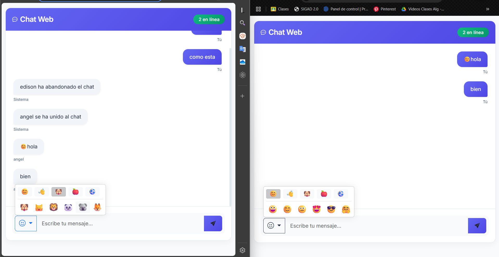
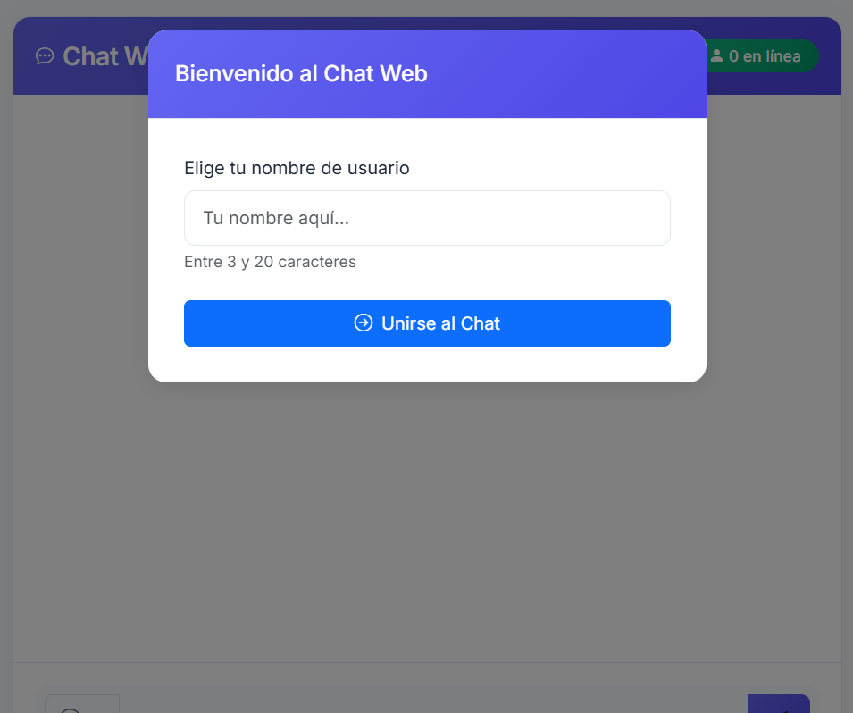
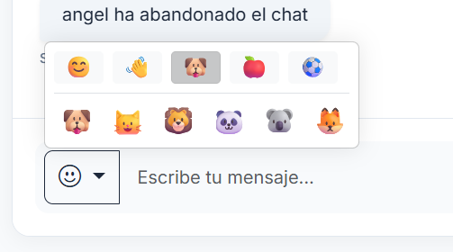
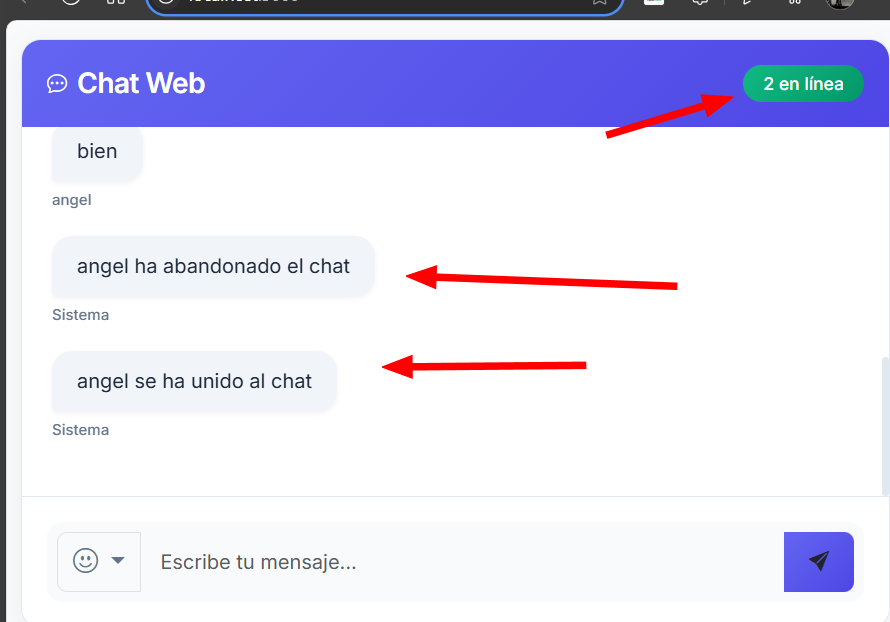

# Chat en Tiempo Real con Sockets

**Estudiante:** [Tu Nombre Completo]
**Fecha de Entrega:** 30 de Mayo de 2025

## Introducción

Este proyecto implementa un chat en tiempo real utilizando WebSockets, permitiendo la comunicación instantánea entre múltiples usuarios. La implementación de sockets es crucial en aplicaciones de chat ya que permite:

- Comunicación bidireccional en tiempo real
- Bajo consumo de recursos del servidor
- Mejor experiencia de usuario sin necesidad de recargar la página
- Entrega instantánea de mensajes

## Repositorio Base

Este proyecto está basado en el repositorio proporcionado por el docente:
[Repositorio Original](https://github.com/paulosk8/webChat/tree/main)

El repositorio contiene dos ramas principales:
- `main`: Código inicial del proyecto
- `implementacion-chat`: Versión final de referencia

## Implementación del Proyecto

### Estructura del Código

```
webChat/
├── src/
│   ├── public/
│   │   ├── css/
│   │   │   └── style.css
│   │   └── js/
│   │       └── script.js
│   ├── views/
│   │   └── index.html
│   └── realTimeServer.js
├── screenshots/
└── README.md
```

### Mejoras Implementadas

1. **Diseño Moderno**
   - Interfaz limpia y minimalista
   - Paleta de colores moderna
   - Diseño responsive para móviles y tablets
   

2. **Sistema de Login**
   - Modal de inicio con nombre de usuario
   - Validación de nombres duplicados
   - Persistencia de sesión
   

3. **Selector de Emojis**
   - Categorías organizadas
   - Emojis nativos del sistema
   - Interfaz intuitiva
   

4. **Notificaciones**
   - Alertas de usuarios conectados/desconectados
   - Indicador de escritura
   - Sonidos de notificación
   

## Instrucciones de Ejecución

1. **Clonar el Repositorio**
   ```bash
   git clone [URL del repositorio]
   cd webChat
   ```

2. **Instalar Dependencias**
   ```bash
   npm install
   ```

3. **Iniciar el Servidor**
   ```bash
   cd src
   node realTimeServer.js
   ```

4. **Acceder al Chat**
   - Abrir `http://localhost:3000` en el navegador
   - Ingresar un nombre de usuario
   - ¡Comenzar a chatear!

## Conclusiones

### Aprendizajes

- Implementación práctica de WebSockets
- Manejo de eventos en tiempo real
- Diseño de interfaces responsivas
- Gestión de estado en aplicaciones web

### Dificultades y Soluciones

1. **Manejo de Usuarios Simultáneos**
   - Problema: Conflictos con nombres de usuario duplicados
   - Solución: Implementación de validación en tiempo real

2. **Selector de Emojis**
   - Problema: Compatibilidad entre navegadores
   - Solución: Uso de emojis nativos y diseño adaptativo

3. **Notificaciones**
   - Problema: Experiencia de usuario en múltiples pestañas
   - Solución: Sistema de notificaciones centralizado

## Referencias

1. [Socket.IO Documentation](https://socket.io/docs/v4/)
2. [Bootstrap 5 Documentation](https://getbootstrap.com/docs/5.3/)
3. [MDN Web Docs - WebSockets API](https://developer.mozilla.org/en-US/docs/Web/API/WebSockets_API)
4. [Node.js Documentation](https://nodejs.org/docs/latest/api/)

---

*Nota: Las capturas de pantalla mostradas en este README están almacenadas en la carpeta `/screenshots` del repositorio.*
